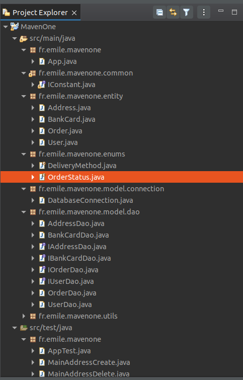

[< précédent](../README.md)

# bluejar

ven. 19 mai 2023 13:04:16 CEST
bluejar

# Installation

1. Cloner le repository

# Qu'il a t-il sous le capot ?

1. [Java jdk-8u202-linux-x64](https://www.oracle.com/java/technologies/javase/javase8-archive-downloads.html)
1. [apache maven project](https://maven.apache.org/)
1. [Mysql](https://www.mysql.com/fr/)
1. [Tomcat 9](https://tomcat.apache.org/download-90.cgi)

# Organisation du code

1. /src/main/java/fr/emile/Main.java : Point d'entrée de l'application
1. /src/main/java/fr/emile/entity/: Les Pojos et beans
1. /src/main/java/fr/emile/common/: Les constantes commun au projet
1. /src/main/java/fr/emile/enums/: Les types enumérés
1. /src/main/java/fr/emile/model/connection: Les connexions vers l'extérieur
1. /src/main/java/fr/emile/model/dao: Les class d'acces aux bases de données
1. /src/main/java/fr/emile/utils: Les class utilitaires
1. /src/main/resources/ Les fichiers de ressources
1. /src/test/java/fr/emile/ Les class de tests unitaire

# Documentation projet

1. [Préambule](./doc/preambule.md)
1. [Cahier des charge](./doc/cahier-des-charge.md)
1. [Analyse](./doc/specification-fonctionelle.md)
1. [Developpement](./doc/specification-technique.md)
1. [Test](.doc/test.md)
