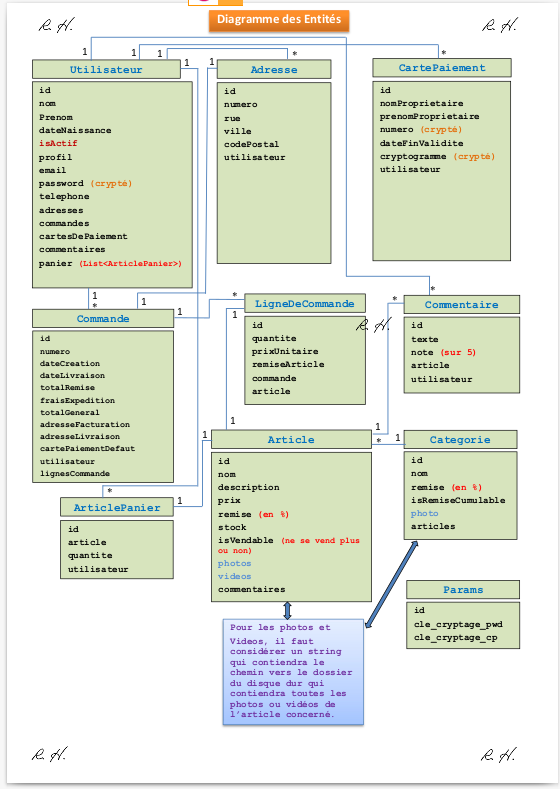

[< précédent](../README.md)

# préambule

# model de donnée

# vue

Pages xhtml à créer (côté FRONT-END) :

1. index.jsp : qui redirige systématiquement vers accueil.xhtml
1. accueil.xhtml
1. add-utilisateur.xhtml
1. login-utilisateur.xhtml
1. article.xhtml
1. gestion-achats.xhtml
1. gestion-articles.xhtml
1. gestion-admin.xhtml

# controle

tests unitaires

Les tests sont dans src/test/java dans la package fr.emile.test

# stratégie de développement

1. entity bean
1. générateur de test
1. création des tables par hibernate
1. backing bean
1. page Xhtml, css

# stratégie de test

Les tests unitaire cloture chaque étape.
Les cas de test, jeu de test et resultat des tests est sauvegardé et fait partie de la livraison.

# Découpe en macro fonction

# découpe par profil Admin, Magasinier, client

# Chiffrage

# Suivie de projet
